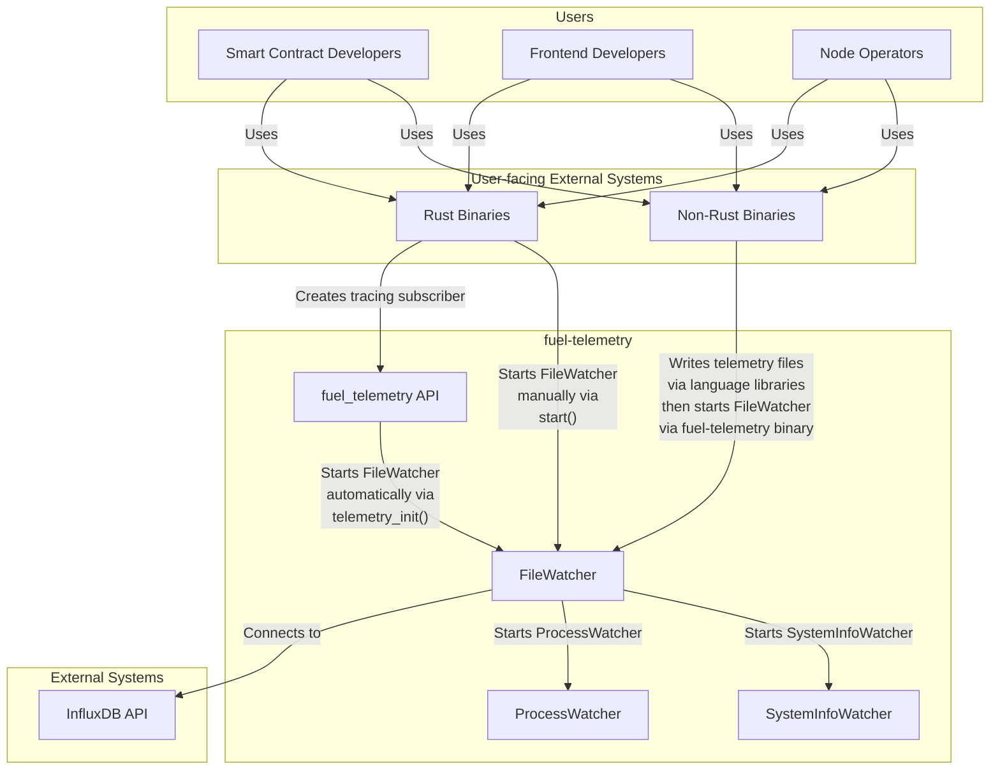
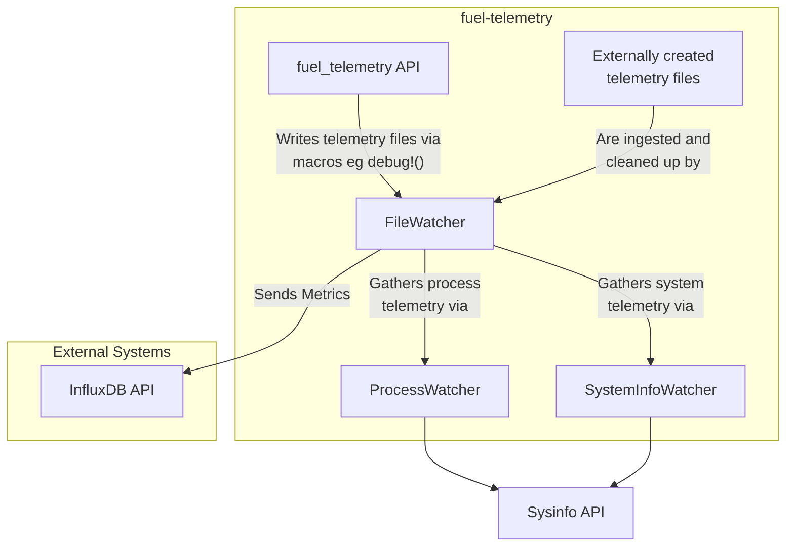
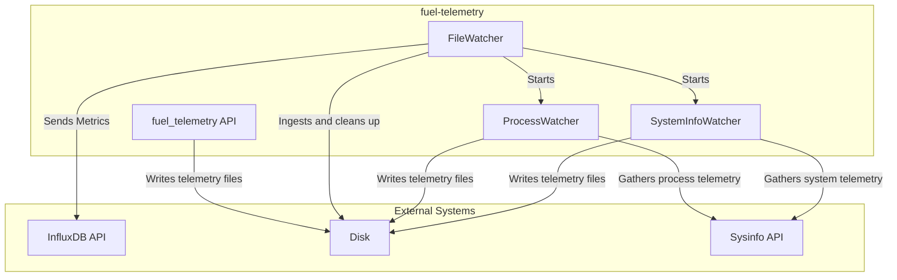
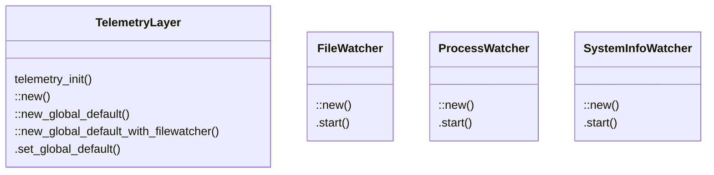

# `fuel-telemetry` Architecture Design

This document describes the `fuel-telemetry` architectural design using the [C4 Model](https://c4model.com/).

### Level 1: Context Diagram

The Context Diagram provides a high-level overview of `fuel-telemetry`, its users, and its interactions with external systems.

### Level 2: Container Diagram

The Container Diagram shows the main containers of `fuel-telemetry` and their interactions.

### Level 3: Component Diagram

The Component Diagram breaks down each container into its individual components and shows their interactions.

### Level 4: Code Diagram

The Code Diagram provides a detailed view of the code structure within each component. This level is typically represented using class diagrams, package diagrams, or similar.

